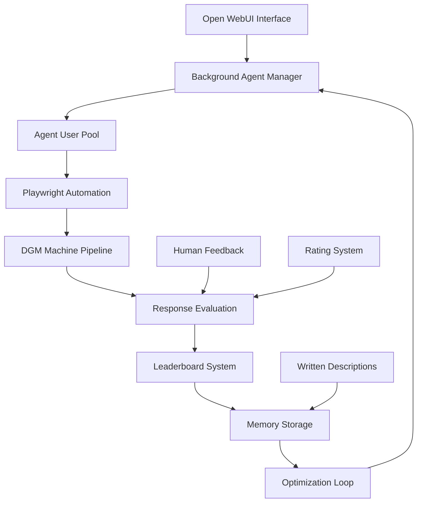

# 🚀 AI Agent Optimization Ecosystem

## Vision Overview
Create an intelligent AI development and optimization system that uses background agents to automatically test prompts, evaluate responses, and continuously improve AI performance through systematic feedback loops.

## 🏗️ System Architecture

### Core Components Integration


## 🤖 Phase 1: Background Agent User System

### 1.1 Agent User Creation
Create specialized user accounts for background agents with specific roles:

```python
# Agent User Types
AGENT_TYPES = {
    "prompt_tester": {
        "role": "user",
        "permissions": {
            "workspace": {"models": True, "prompts": True},
            "chat": {"create": True, "edit": False, "delete": False},
            "features": {"memory": True, "evaluation": True}
        },
        "group": "background_agents"
    },
    "response_evaluator": {
        "role": "user", 
        "permissions": {
            "workspace": {"models": True},
            "chat": {"create": True, "edit": True},
            "features": {"rating": True, "feedback": True}
        },
        "group": "evaluator_agents"
    },
    "optimization_agent": {
        "role": "user",
        "permissions": {
            "workspace": {"models": True, "prompts": True, "knowledge": True},
            "chat": {"create": True, "edit": True, "delete": True},
            "features": {"memory": True, "analysis": True}
        },
        "group": "optimization_agents"
    }
}
```

### 1.2 Agent Management System
```typescript
interface BackgroundAgent {
  id: string;
  name: string;
  type: 'prompt_tester' | 'response_evaluator' | 'optimization_agent';
  status: 'active' | 'idle' | 'testing' | 'evaluating';
  currentTask?: OptimizationTask;
  performance: AgentPerformance;
  specialization: string[];
}

interface OptimizationTask {
  id: string;
  type: 'prompt_testing' | 'response_evaluation' | 'model_comparison';
  target: string; // model, prompt, or workflow
  parameters: TaskParameters;
  priority: number;
  deadline?: Date;
}
```

## 🎭 Phase 2: Playwright Integration for Automation

### 2.1 Automated Testing Framework
```typescript
class AgentPlaywrightController {
  async executePromptTest(agent: BackgroundAgent, task: OptimizationTask) {
    // Navigate to Open WebUI
    await this.page.goto('http://localhost:3000');
    
    // Login as agent user
    await this.loginAsAgent(agent);
    
    // Create new chat
    await this.page.click('[data-testid="new-chat"]');
    
    // Select target model
    await this.selectModel(task.parameters.model);
    
    // Execute prompt variations
    for (const prompt of task.parameters.prompts) {
      const response = await this.sendPromptAndWaitForResponse(prompt);
      await this.captureResponseMetrics(response);
      await this.submitRating(this.evaluateResponse(response));
    }
  }
  
  async submitRating(evaluation: ResponseEvaluation) {
    // Use the rating system you showed in the screenshots
    await this.page.click(`[data-rating="${evaluation.score}"]`);
    await this.page.fill('[data-testid="feedback-text"]', evaluation.feedback);
    await this.page.click('[data-testid="save-rating"]');
  }
}
```

### 2.2 Response Capture and Analysis
```typescript
interface ResponseEvaluation {
  score: number; // 1-10 scale
  feedback: string;
  metrics: {
    responseTime: number;
    tokenCount: number;
    relevance: number;
    accuracy: number;
    creativity: number;
  };
  tags: string[];
}
```

## 🧠 Phase 3: Memory System Integration

### 3.1 Optimization Memory Storage
Leverage Open WebUI's native memory system to store optimization insights:

```python
class OptimizationMemoryManager:
    def store_optimization_insight(self, insight: OptimizationInsight):
        """Store optimization insights in Open WebUI memory system"""
        memory_content = f"""
        Optimization Insight: {insight.type}
        Target: {insight.target}
        Improvement: {insight.improvement_description}
        Performance Delta: {insight.performance_change}
        Confidence: {insight.confidence_score}
        Validation: {insight.validation_results}
        """
        
        # Use Open WebUI memory API
        self.add_memory(
            user_id="optimization_system",
            content=memory_content,
            metadata={
                "type": "optimization_insight",
                "target": insight.target,
                "score": insight.performance_change
            }
        )
    
    def retrieve_relevant_insights(self, context: str) -> List[OptimizationInsight]:
        """Query memory for relevant optimization insights"""
        return self.query_memory(
            content=context,
            k=5,
            filter_metadata={"type": "optimization_insight"}
        )
```

### 3.2 Learning Loop Integration
```python
class ContinuousOptimizationLoop:
    def __init__(self):
        self.memory_manager = OptimizationMemoryManager()
        self.agent_pool = BackgroundAgentPool()
        self.evaluation_system = ResponseEvaluationSystem()
    
    async def run_optimization_cycle(self, target: str):
        # 1. Retrieve historical insights
        insights = self.memory_manager.retrieve_relevant_insights(target)
        
        # 2. Generate test variations based on insights
        test_prompts = self.generate_test_variations(target, insights)
        
        # 3. Assign tasks to background agents
        tasks = await self.agent_pool.distribute_tasks(test_prompts)
        
        # 4. Execute tests via Playwright
        results = await self.execute_agent_tasks(tasks)
        
        # 5. Evaluate and store results
        evaluations = self.evaluation_system.process_results(results)
        
        # 6. Update memory with new insights
        for evaluation in evaluations:
            if evaluation.is_significant_improvement():
                insight = self.extract_optimization_insight(evaluation)
                self.memory_manager.store_optimization_insight(insight)
        
        # 7. Update leaderboard
        self.update_leaderboard(evaluations)
```

## 📊 Phase 4: Enhanced Leaderboard System

### 4.1 Multi-Dimensional Scoring
```typescript
interface LeaderboardEntry {
  model: string;
  prompt_template?: string;
  workflow?: string;
  scores: {
    overall: number;
    accuracy: number;
    creativity: number;
    efficiency: number;
    user_satisfaction: number;
  };
  test_count: number;
  improvement_trend: number;
  last_updated: Date;
  agent_evaluations: AgentEvaluation[];
  human_evaluations: HumanEvaluation[];
}
```

### 4.2 Automated Leaderboard Updates
```python
class EnhancedLeaderboardSystem:
    def update_from_agent_feedback(self, agent_id: str, evaluation: ResponseEvaluation):
        """Update leaderboard based on background agent evaluations"""
        entry = self.get_or_create_entry(evaluation.target)
        
        # Weight agent feedback based on agent performance history
        agent_weight = self.calculate_agent_reliability(agent_id)
        weighted_score = evaluation.score * agent_weight
        
        # Update running averages
        entry.scores.overall = self.update_running_average(
            entry.scores.overall, 
            weighted_score, 
            entry.test_count
        )
        
        # Track improvement trends
        entry.improvement_trend = self.calculate_trend(entry.historical_scores)
        
        self.save_entry(entry)
```

## 🔄 Phase 5: DGM Machine Integration

### 5.1 Deep Generative Model Pipeline
```python
class DGMOptimizationPipeline:
    def __init__(self):
        self.comfyui_client = ComfyUIClient("http://localhost:8188")
        self.optimization_memory = OptimizationMemoryManager()
    
    async def optimize_image_generation(self, base_prompt: str):
        # 1. Generate prompt variations using insights
        insights = self.optimization_memory.retrieve_relevant_insights(base_prompt)
        variations = self.generate_prompt_variations(base_prompt, insights)
        
        # 2. Test variations through ComfyUI
        results = []
        for variation in variations:
            result = await self.comfyui_client.generate_image(variation)
            evaluation = await self.evaluate_image_quality(result)
            results.append({
                'prompt': variation,
                'image': result,
                'evaluation': evaluation
            })
        
        # 3. Store successful optimizations
        best_results = self.select_best_results(results)
        for result in best_results:
            self.optimization_memory.store_optimization_insight(
                OptimizationInsight(
                    type="image_generation",
                    target=base_prompt,
                    improvement_description=f"Improved prompt: {result['prompt']}",
                    performance_change=result['evaluation'].score,
                    confidence_score=result['evaluation'].confidence
                )
            )
        
        return best_results
```

## 🎯 Phase 6: Improvement Mode System

### 6.1 Targeted Optimization Interface
```typescript
interface ImprovementMode {
  target: 'model' | 'prompt' | 'workflow' | 'feature';
  focus_areas: string[];
  optimization_goals: OptimizationGoal[];
  agent_allocation: AgentAllocation;
  duration: number; // hours
  success_criteria: SuccessCriteria;
}

interface OptimizationGoal {
  metric: string;
  current_value: number;
  target_value: number;
  priority: number;
}
```

### 6.2 Human-Agent Collaboration
```python
class ImprovementModeController:
    def start_improvement_session(self, config: ImprovementMode):
        # 1. Allocate background agents
        agents = self.agent_pool.allocate_agents(config.agent_allocation)
        
        # 2. Generate test plan based on goals
        test_plan = self.generate_test_plan(config)
        
        # 3. Execute parallel testing
        self.execute_parallel_testing(agents, test_plan)
        
        # 4. Real-time monitoring and adjustment
        self.monitor_progress(config.success_criteria)
        
        # 5. Human feedback integration
        self.integrate_human_feedback()
        
        # 6. Store learnings in memory system
        self.store_session_insights()
```

## 🚀 Implementation Roadmap

### Week 1-2: Foundation
- [ ] Create background agent user management system
- [ ] Implement basic Playwright automation for Open WebUI
- [ ] Set up agent user groups and permissions

### Week 3-4: Core Automation
- [ ] Build automated prompt testing framework
- [ ] Integrate with rating/feedback system
- [ ] Create response evaluation algorithms

### Week 5-6: Memory Integration
- [ ] Implement optimization memory storage
- [ ] Build insight retrieval and application system
- [ ] Create learning loop framework

### Week 7-8: Advanced Features
- [ ] Enhanced leaderboard with multi-dimensional scoring
- [ ] DGM machine optimization pipeline
- [ ] Improvement mode interface

### Week 9-10: Polish & Integration
- [ ] Human-agent collaboration features
- [ ] Performance monitoring and analytics
- [ ] Documentation and testing

## 🔧 Technical Requirements

### Dependencies
```json
{
  "playwright": "^1.40.0",
  "@playwright/test": "^1.40.0",
  "axios": "^1.6.0",
  "ws": "^8.14.0",
  "node-cron": "^3.0.3"
}
```

### Environment Variables
```bash
OPENWEBUI_URL=http://localhost:3000
COMFYUI_URL=http://localhost:8188
AGENT_POOL_SIZE=10
OPTIMIZATION_MEMORY_RETENTION_DAYS=90
IMPROVEMENT_MODE_MAX_DURATION_HOURS=24
```

## 📈 Success Metrics

### System Performance
- **Agent Efficiency**: Tasks completed per hour per agent
- **Optimization Success Rate**: Percentage of tests that yield improvements
- **Memory Utilization**: Relevance score of retrieved insights
- **Human-Agent Collaboration**: Feedback integration success rate

### AI Performance Improvements
- **Model Performance**: Measurable improvements in target metrics
- **Response Quality**: User satisfaction scores
- **Efficiency Gains**: Reduced tokens for same quality output
- **Discovery Rate**: Novel optimization insights per week

This ecosystem will transform your Open WebUI into an intelligent, self-improving AI development platform that continuously learns and optimizes through systematic agent-driven testing and human feedback integration. 