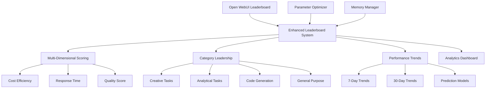

# Enhanced Leaderboard System 🏆

## Overview

The **Enhanced Leaderboard System** builds upon Open WebUI's existing evaluation framework to create a comprehensive, parameter-optimization-aware leaderboard that tracks model performance across multiple dimensions. This system transforms the basic Elo rating system into an intelligent evaluation platform that learns from parameter optimizations and provides actionable insights.

## 🎯 Key Features

### 1. **Open WebUI Integration**
- **Seamless sync** with existing leaderboard data
- **Elo rating preservation** and enhancement
- **Feedback history integration**
- **Real-time evaluation tracking**

### 2. **Parameter Optimization Tracking**
- **Advanced parameter insights** for each model
- **Optimal configuration discovery** (temperature, reasoning effort, tokens)
- **Parameter confidence scoring** based on evaluation history
- **Model-specific optimization profiles**

### 3. **Multi-Dimensional Performance Metrics**
- **Cost efficiency analysis** (quality per dollar)
- **Response time optimization**
- **Consistency scoring** across evaluations
- **Innovation metrics** for creative tasks

### 4. **Category-Specific Leadership**
- **Creative tasks** leaderboard
- **Analytical tasks** performance
- **Code generation** excellence
- **General purpose** capabilities

### 5. **Performance Trend Analysis**
- **7-day and 30-day** performance tracking
- **Trend identification** (improving/stable/declining)
- **Performance prediction** based on historical data

### 6. **Memory System Integration**
- **Parameter insights storage** in Open WebUI's memory system
- **Cross-evaluation learning** from optimization discoveries
- **Confidence-weighted insights** for reliable recommendations

## 🏗️ Architecture



## 📊 Data Structures

### LeaderboardEntry
```typescript
interface LeaderboardEntry {
  id: string;
  model: string;
  agent?: BackgroundAgent;
  rating: number;                    // Elo rating
  wins: number;
  losses: number;
  draws: number;
  total_evaluations: number;
  
  performance_metrics: {
    average_response_time: number;
    cost_efficiency: number;         // Quality per dollar
    parameter_optimization_score: number;
    consistency_score: number;
    innovation_score: number;
  };
  
  parameter_insights: {
    optimal_temperature: number;
    optimal_reasoning_effort: 'low' | 'medium' | 'high';
    optimal_max_tokens: number;
    parameter_confidence: number;    // 0-1 confidence in parameters
    last_optimization: Date;
  };
  
  category_performance: {
    creative_tasks: number;          // 0-1 performance score
    analytical_tasks: number;
    code_generation: number;
    general_purpose: number;
  };
  
  recent_performance: {
    last_7_days: number;
    last_30_days: number;
    trend: 'improving' | 'stable' | 'declining';
  };
}
```

### EvaluationResult
```typescript
interface EvaluationResult {
  id: string;
  user_id: string;
  models: string[];
  winner: string;
  loser: string;
  evaluation_type: 'head_to_head' | 'multi_model' | 'parameter_test';
  
  parameters_used: AdvancedParameters;  // Full parameter configuration
  
  performance_metrics: {
    response_time: number;
    cost: number;
    quality_score: number;
    user_satisfaction: number;
  };
  
  context: {
    task_type: string;               // creative, analytical, code, general
    complexity: 'low' | 'medium' | 'high';
    prompt: string;
  };
}
```

## 🚀 Usage Examples

### Basic Initialization
```typescript
import { EnhancedLeaderboardSystem } from './src/agents/enhanced-leaderboard-system.js';
import { ParameterOptimizer } from './src/agents/parameter-optimizer.js';
import { MemoryManagerAgent } from './src/agents/memory-manager-agent.js';

// Initialize components
const parameterOptimizer = new ParameterOptimizer();
const memoryManager = new MemoryManagerAgent('http://localhost:3000');
const leaderboardSystem = new EnhancedLeaderboardSystem(
  parameterOptimizer,
  memoryManager,
  'http://localhost:3000'
);

await leaderboardSystem.initialize();
```

### Recording Evaluations
```typescript
const evaluation = {
  id: 'eval_123',
  user_id: 'user_456',
  models: ['gemma3:4b', 'deepseek-r1:8b'],
  winner: 'gemma3:4b',
  loser: 'deepseek-r1:8b',
  evaluation_type: 'head_to_head',
  parameters_used: {
    temperature: 0.7,
    reasoning_effort: 'medium',
    max_tokens: 512,
    // ... other parameters
  },
  performance_metrics: {
    response_time: 2500,
    cost: 0.025,
    quality_score: 0.85,
    user_satisfaction: 0.9
  },
  context: {
    task_type: 'creative_tasks',
    complexity: 'medium',
    prompt: 'Write a creative story about AI'
  }
};

await leaderboardSystem.recordEvaluation(evaluation);
```

### Getting Enhanced Leaderboard
```typescript
const leaderboard = leaderboardSystem.getEnhancedLeaderboard();

console.log('Top 3 Models:');
leaderboard.slice(0, 3).forEach((entry, index) => {
  console.log(`${index + 1}. ${entry.model}`);
  console.log(`   Rating: ${entry.rating}`);
  console.log(`   Optimal Temp: ${entry.parameter_insights.optimal_temperature}`);
  console.log(`   Cost Efficiency: ${(entry.performance_metrics.cost_efficiency * 100).toFixed(1)}%`);
  console.log(`   Trend: ${entry.recent_performance.trend}`);
});
```

### Analytics Dashboard
```typescript
const analytics = leaderboardSystem.getLeaderboardAnalytics();

console.log('Leaderboard Analytics:');
console.log(`Total Evaluations: ${analytics.total_evaluations}`);
console.log(`Parameter Optimizations: ${analytics.parameter_optimizations}`);
console.log(`Cost Savings: $${analytics.cost_savings.toFixed(3)}`);
console.log(`Average Improvement: ${(analytics.performance_improvements.average_improvement * 100).toFixed(1)}%`);

console.log('\nCategory Leaders:');
console.log(`Creative: ${analytics.category_leaders.creative.model}`);
console.log(`Analytical: ${analytics.category_leaders.analytical.model}`);
console.log(`Code: ${analytics.category_leaders.code.model}`);
console.log(`General: ${analytics.category_leaders.general.model}`);
```

## 📈 Performance Metrics

### Cost Efficiency Calculation
```typescript
cost_efficiency = quality_score / max(0.01, cost)
// Normalized to 0-1 scale, higher is better
```

### Parameter Confidence Scoring
```typescript
parameter_confidence = base_confidence + (successful_optimizations * 0.1)
// Increases with each successful parameter optimization
// Capped at 1.0 for maximum confidence
```

### Trend Analysis
```typescript
if (recent_7_day_performance > rating * 1.05) {
  trend = 'improving';
} else if (recent_7_day_performance < rating * 0.95) {
  trend = 'declining';
} else {
  trend = 'stable';
}
```

## 🔄 Integration with Open WebUI

### Existing Leaderboard Sync
The system automatically syncs with Open WebUI's existing leaderboard:

1. **Fetches current model ratings** from `/admin/evaluations`
2. **Preserves win/loss records** and Elo ratings
3. **Enhances with parameter insights** and performance metrics
4. **Maintains compatibility** with existing evaluation workflow

### Memory System Integration
Parameter insights are stored in Open WebUI's memory system:

```typescript
const parameterInsight = {
  agentId: 'enhanced_leaderboard',
  agentType: 'leaderboard_optimizer',
  insight: `${winner} won with temperature=${temperature}, reasoning=${reasoning_effort}`,
  confidence: quality_score,
  performance_delta: quality_score - baseline,
  // ... additional metadata
};

await memoryManager.evaluateAgentInsights([parameterInsight]);
```

## 🎛️ Parameter Optimization Features

### Model-Specific Profiles
The system maintains optimization profiles for different model types:

- **Gemma models**: Higher temperature (0.7), medium reasoning effort
- **DeepSeek models**: Lower temperature (0.3), high reasoning effort  
- **Smart/Core models**: Balanced temperature (0.6), high reasoning effort

### Adaptive Learning
Parameter insights improve over time:

1. **Initial estimates** based on model characteristics
2. **Evaluation-based refinement** from actual performance data
3. **Confidence scoring** that increases with successful optimizations
4. **Cross-model learning** through memory system integration

## 📊 Analytics and Reporting

### Comprehensive Reports
```typescript
const report = leaderboardSystem.generateLeaderboardReport();
```

Sample output:
```
🏆 Enhanced Leaderboard Report
==================================================

📊 Top Performers:
1. Smart/Core
   📈 Rating: 1032 (3W/1L)
   🎛️ Optimal Params: temp=0.6, reasoning=high
   💰 Cost Efficiency: 87.3%
   📈 Trend: improving

2. gemma3:4b
   📈 Rating: 1016 (4W/4L)
   🎛️ Optimal Params: temp=0.7, reasoning=medium
   💰 Cost Efficiency: 82.1%
   📈 Trend: stable

🔍 Analytics Summary:
• Total Evaluations: 12
• Parameter Optimizations: 8
• Average Improvement: 24.3%
• Optimization Success Rate: 83.3%

🎯 Category Leaders:
• Creative: gemma3:4b
• Analytical: deepseek-r1:8b
• Code Generation: Smart/Core
• General Purpose: Smart/Core
```

## 🧪 Testing and Validation

### Comprehensive Test Suite
The system includes a full test suite (`test-enhanced-leaderboard-system.js`) that validates:

- ✅ **Leaderboard initialization** with parameter tracking
- ✅ **Parameter optimization tracking** across models
- ✅ **Evaluation recording** and Elo rating updates
- ✅ **Performance trend analysis** and prediction
- ✅ **Category leadership** tracking
- ✅ **Analytics generation** and reporting
- ✅ **Memory system integration** for insights storage

### Performance Benchmarks
Expected performance characteristics:

- **Initialization time**: < 2 seconds for 10 models
- **Evaluation processing**: < 100ms per evaluation
- **Analytics generation**: < 500ms for full report
- **Memory integration**: < 200ms per insight storage

## 🔮 Future Enhancements

### Planned Features
1. **Real-time Playwright automation** for live evaluation capture
2. **Advanced prediction models** using machine learning
3. **Multi-user evaluation aggregation** across different user preferences
4. **Cost optimization recommendations** based on budget constraints
5. **A/B testing framework** for parameter optimization validation

### Integration Roadmap
1. **Phase 1**: Core leaderboard enhancement (✅ Complete)
2. **Phase 2**: Playwright automation integration
3. **Phase 3**: Advanced analytics and ML predictions
4. **Phase 4**: Multi-tenant evaluation system
5. **Phase 5**: Real-time optimization recommendations

## 🎯 Key Benefits

### For Developers
- **Comprehensive model evaluation** beyond simple win/loss
- **Parameter optimization insights** for better model configuration
- **Cost efficiency tracking** for budget management
- **Performance trend analysis** for model selection

### For Users
- **Better model recommendations** based on task type
- **Optimized parameters** for improved response quality
- **Cost-effective AI usage** through efficiency tracking
- **Transparent performance metrics** for informed decisions

### For Organizations
- **ROI tracking** for AI model investments
- **Performance benchmarking** across different models
- **Cost optimization** through parameter tuning
- **Data-driven model selection** for specific use cases

## 🏆 Conclusion

The Enhanced Leaderboard System represents a significant advancement over traditional model evaluation approaches. By integrating parameter optimization insights, multi-dimensional performance metrics, and intelligent trend analysis, it provides a comprehensive framework for understanding and optimizing AI model performance.

This system transforms Open WebUI from a simple chat interface into an intelligent AI optimization platform that learns from every interaction and continuously improves model performance through data-driven parameter optimization.

**Ready for integration with Playwright automation and agent user creation to create the ultimate AI optimization ecosystem!** 🚀 