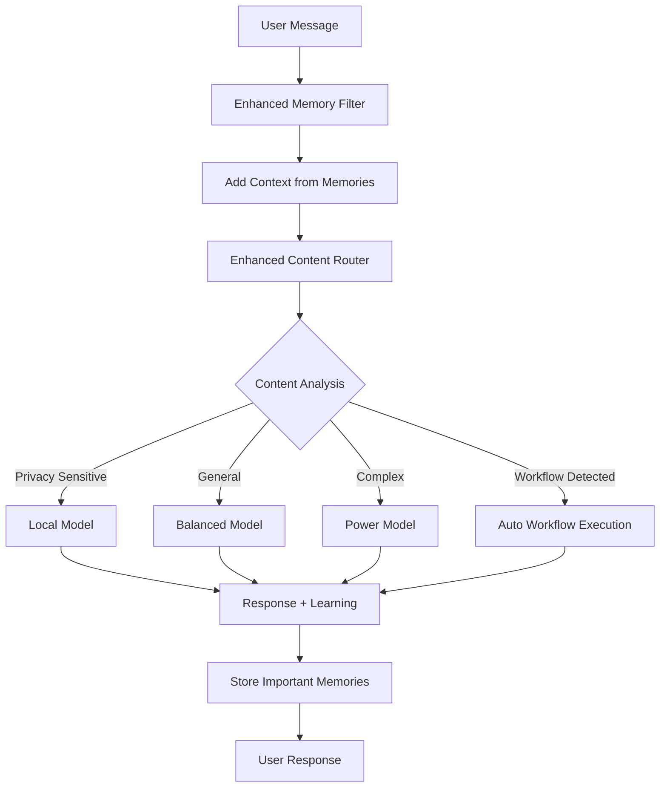

# 🚀 Open WebUI Integration Guide

## Enhanced Content Generation Pipeline Functions

Transform your Open WebUI instance into an intelligent AI assistant with privacy-first routing, workflow automation, and adaptive learning.

## 📦 Function Overview

Our enhanced system provides three complementary Open WebUI functions:

### 1. 🎯 Enhanced Content Router (Pipe)
**File:** `enhanced-content-router.py`
- **Type:** Manifold Pipe 
- **Purpose:** Intelligent content routing with privacy-first processing
- **Features:**
  - Privacy-sensitive content detection → Local models
  - Complexity analysis → Appropriate model tier (local/balanced/power)
  - Automatic workflow detection and execution
  - Adaptive user preference learning
  - Real-time routing feedback

### 2. 🧠 Enhanced Memory Filter (Filter)
**File:** `enhanced-memory-filter.py`
- **Type:** Input/Output Filter
- **Purpose:** Intelligent memory management and context building
- **Features:**
  - Privacy-aware memory storage (never stores sensitive data)
  - Automatic importance scoring and relevance detection
  - Context enhancement from conversation history
  - Structured information extraction
  - Memory retention management

### 3. ⚡ Workflow Action (Action)
**File:** `workflow-action.py`
- **Type:** Manual Action Button
- **Purpose:** On-demand workflow execution for complex tasks
- **Features:**
  - 5 pre-built professional workflows
  - Interactive workflow selection and customization
  - Step-by-step execution with progress tracking
  - Multi-step result compilation
  - Time estimation and progress indicators

## 🛠️ Installation Instructions

### Step 1: Access Open WebUI Functions
1. Open your Open WebUI instance
2. Navigate to **Admin Panel** → **Settings** → **Functions**
3. Click **"+ Add Function"**

### Step 2: Install Enhanced Content Router
1. Copy the contents of `src/integrations/enhanced-content-router.py`
2. Paste into the function editor
3. Click **"Save"**
4. Enable the function in **Models** → Select your model → **Functions** → Toggle ON "Enhanced Content Router"

### Step 3: Install Enhanced Memory Filter  
1. Create a new function
2. Copy the contents of `src/integrations/enhanced-memory-filter.py`
3. Paste into the function editor
4. Click **"Save"**
5. Enable the filter in **Settings** → **Functions** → Toggle ON "Enhanced Memory Filter"

### Step 4: Install Workflow Action
1. Create a new function
2. Copy the contents of `src/integrations/workflow-action.py`
3. Paste into the function editor
4. Click **"Save"**
5. The action button will appear in your chat interface

## ⚙️ Configuration

### Enhanced Content Router Settings
Access via **Functions** → **Enhanced Content Router** → **Valves**:

```python
# Model Configuration
LOCAL_MODEL = "llama3:instruct"          # Your local model
BALANCED_MODEL = "gpt-4o-mini"           # Balanced API model  
POWER_MODEL = "claude-3-5-sonnet"        # High-capability model

# Privacy & Routing
PRIVACY_FIRST = True                     # Prioritize local processing
ENABLE_WORKFLOWS = True                  # Auto-detect workflows
ENABLE_LEARNING = True                   # Learn user preferences

# Privacy Keywords (customize for your needs)
PRIVACY_KEYWORDS = [
    "password", "personal", "private", "confidential", 
    "bank", "medical", "financial"
]
```

### Enhanced Memory Filter Settings
```python
# Memory Management
MAX_MEMORIES_PER_USER = 100             # Memory limit per user
MEMORY_RETENTION_DAYS = 30              # Auto-cleanup old memories
CONTEXT_RELEVANCE_THRESHOLD = 0.6       # Relevance for context inclusion

# Privacy Protection
PRIVACY_AWARE = True                    # Never store sensitive data
```

### Workflow Action Settings
```python
# Available Workflows
- Deep Research Workflow (10-15 min)
- Coding Project Workflow (15-20 min)  
- Content Creation Workflow (8-12 min)
- Project Planning Workflow (10-15 min)
- Problem Solving Workflow (8-12 min)
```

## 🎭 Usage Examples

### Automatic Smart Routing
```
User: "Help me debug this authentication code with my API keys"
System: 🔒 Privacy-sensitive content detected → Routing to local model
Result: Processes locally to protect your API keys
```

```
User: "I want to research the latest advances in quantum computing"  
System: 🚀 Research workflow detected → Multi-step research process
Result: Executes 5-step research workflow automatically
```

### Manual Workflow Execution
1. Click the **"🚀 Workflow Action"** button in chat
2. Select workflow type (e.g., "Deep Research Workflow")
3. Enter your specific requirements
4. Watch as the system executes each step with progress updates

### Memory & Context Enhancement
```
User: "What was that React component pattern we discussed?"
System: 🧠 Found 3 relevant memories from previous conversations
Result: Enhanced response with context from your coding history
```

## 🔄 System Architecture



## 🛡️ Privacy Features

### Automatic Privacy Protection
- **Sensitive Data Detection:** Passwords, API keys, personal info never stored
- **Local Processing:** Privacy-sensitive content routed to local models
- **Memory Filtering:** Automatic sanitization of stored conversations
- **User Control:** Full control over memory retention and privacy settings

### Privacy Indicators
- 🔒 **Privacy Mode:** Sensitive content detected, using local processing
- 🌐 **Standard Mode:** General content, using optimal routing
- 🧠 **Memory Enhanced:** Context added from previous conversations

## 📊 Smart Features

### Adaptive Learning
- **User Preferences:** Learns your preferred processing approaches
- **Content Patterns:** Improves workflow detection over time
- **Model Selection:** Adapts to your usage patterns for better routing

### Workflow Intelligence
- **Auto-Detection:** Recognizes research, coding, writing, and planning tasks
- **Multi-Step Execution:** Breaks complex tasks into manageable steps
- **Progress Tracking:** Real-time updates and completion status
- **Result Compilation:** Organized, actionable deliverables

## 🚨 Troubleshooting

### Function Not Loading
1. Check Python syntax in function editor
2. Verify all required imports are available
3. Review function logs in Admin Panel

### Memory Not Working
1. Ensure filter is enabled for your model
2. Check privacy settings aren't blocking memory storage
3. Verify user ID is being passed correctly

### Routing Issues
1. Confirm models are properly configured and accessible
2. Check valve settings for model names
3. Verify network connectivity for API models

## 🔮 Advanced Usage

### Custom Workflow Creation
Add your own workflows to the `WORKFLOWS` configuration:

```python
"custom_workflow": {
    "name": "My Custom Workflow",
    "description": "Custom task automation",
    "steps": ["Step 1", "Step 2", "Step 3"],
    "estimated_time": "5-10 minutes",
    "model_preference": "balanced"
}
```

### Integration with Existing Functions
Our functions are designed to work alongside:
- **NotDiamond Router:** Enhanced routing can complement API-level routing
- **Auto Memory:** Can work together for comprehensive memory management
- **Artifacts:** Enhanced content can be rendered as artifacts
- **Code Execution:** Workflow outputs can trigger code execution

## 🎯 Success Metrics

After installation, you should experience:
- ✅ **Seamless Privacy Protection:** Sensitive content automatically stays local
- ✅ **Intelligent Workflow Automation:** Complex tasks broken into manageable steps  
- ✅ **Enhanced Context Awareness:** Relevant conversation history enhances responses
- ✅ **Adaptive Performance:** System learns and improves with usage
- ✅ **Professional Deliverables:** Structured, actionable outputs for complex tasks

## 🤝 Contributing

Found issues or have enhancements? Our enhanced system is designed to be:
- **Modular:** Each function works independently
- **Extensible:** Easy to add new workflows and routing logic
- **Privacy-First:** All enhancements maintain privacy protection
- **Community-Driven:** Open to improvements and new features

Transform your Open WebUI into an intelligent, privacy-aware AI assistant today! 🚀 