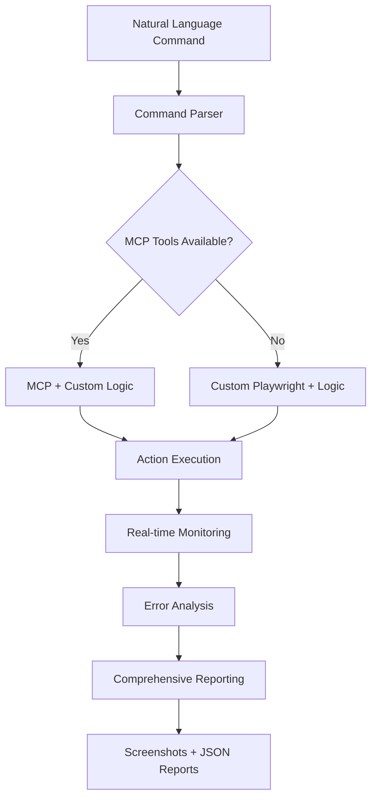

# 🤖 Hybrid Autonomous Testing System

**Advanced AI-Powered Browser Automation for Open WebUI Development**

---

## 🎯 **Overview**

The Hybrid Autonomous Testing System combines **natural language understanding** with **robust browser automation** to provide intelligent, autonomous testing capabilities for your Open WebUI development workflow. It bridges the gap between human intent and technical execution, allowing you to describe what you want tested in plain English and get comprehensive, actionable results.

## 🏗️ **System Architecture**

### **Hybrid Approach: Best of Both Worlds**



### **Core Components**

1. **🧠 Natural Language Parser**
   - Understands complex, multi-step commands
   - Extracts intent and converts to actionable steps
   - Handles quoted text, specific instructions, and context

2. **🔧 Dual Automation Engine**
   - **MCP Tools**: Battle-tested Playwright integration (when available)
   - **Custom Playwright**: Fallback with enhanced error handling
   - **Automatic Detection**: Seamlessly switches between approaches

3. **📊 Real-time Monitoring**
   - Live console log capture and analysis
   - AI response streaming detection
   - Error pattern recognition with suggestions

4. **📋 Comprehensive Reporting**
   - Detailed JSON reports with metrics
   - Screenshot capture at key moments
   - Success/failure analysis with insights

---

## 🚀 **Key Features**

### **✅ Natural Language Commands**
```bash
# Simple commands
"Take a screenshot of the current page"
"Send message 'Hello world' and wait for response"

# Complex workflows
"Test the complete user workflow: start new chat, switch to deepseek model, send message 'Explain quantum computing', wait for response, take screenshot, then verify chat history"

# Development scenarios
"Test all UI components after the latest code changes and report any issues"
```

### **✅ Intelligent Action Recognition**

| Command Pattern | Recognized Action | Example |
|----------------|-------------------|---------|
| `send message "text"` | Message sending | `send message "Hello AI!"` |
| `open sidebar/menu` | UI navigation | `open the sidebar and explore` |
| `switch/change model` | Model switching | `switch to deepseek model` |
| `test chat/messaging` | Chat functionality | `test if chat is working` |
| `take screenshot` | Visual capture | `take screenshot for verification` |
| `verify/check functionality` | System validation | `verify everything works correctly` |

### **✅ Advanced Capabilities**

- **🔄 Multi-step Workflows**: Execute complex sequences automatically
- **🛡️ Error Resilience**: Continue execution even if some steps fail
- **📡 Real-time AI Monitoring**: Capture live AI responses and reasoning
- **🔍 Visual Verification**: Screenshots with before/after comparisons
- **💡 AI-Powered Error Analysis**: Intelligent suggestions for fixes
- **📊 Comprehensive Metrics**: Success rates, timing, and insights

---

## 📖 **How to Use**

### **Basic Usage**

```bash
# Navigate to project directory
cd "/Users/alexanderstoffa/Desktop/Open WebUI + Playwright"

# Run a simple command
python examples/hybrid_autonomous_assistant.py "take screenshot and test chat"

# Run a complex workflow
python examples/hybrid_autonomous_assistant.py "Test the complete Open WebUI workflow: start new chat, switch models, send test message, and verify everything works"
```

### **Command Structure**

**Single Action:**
```bash
python examples/hybrid_autonomous_assistant.py "send message 'Hello from automation!'"
```

**Multiple Actions:**
```bash
python examples/hybrid_autonomous_assistant.py "open sidebar, take screenshot, then test chat functionality"
```

**Complex Workflows:**
```bash
python examples/hybrid_autonomous_assistant.py "Start comprehensive test: create new chat, switch to deepseek model, send message 'Explain AI in simple terms', wait for complete response, take screenshot, open sidebar to verify chat appears in history, then test model selector dropdown"
```

### **Output Interpretation**

**Console Output:**
```
🤖 HYBRID AUTONOMOUS EXECUTION
📝 Command: [your command]
🔧 Using: Custom Logic + Available Tools
============================================================

🎯 Executing X actions...
🔍 Action 1/X: [action description]
✅ Action completed: [success message]
⚠️ Action partially completed: [partial success]
❌ Action failed: [failure with suggestion]

📊 HYBRID AUTONOMOUS SUMMARY
Status: ✅ PASSED (or ❌ FAILED)
Success Rate: XX.X%
Actions Completed: X/X
```

**Generated Files:**
- **Screenshots**: `dev_assistant_screenshots/hybrid_YYYYMMDD_HHMMSS.png`
- **Reports**: `dev_assistant_reports/hybrid_report_YYYYMMDD_HHMMSS.json`

---

## 🎯 **Use Cases**

### **For Development Teams**

**🔧 Feature Testing**
```bash
# Test new features
"Test the new chat export functionality end-to-end"

# Regression testing
"Verify all existing features still work after the latest update"

# Cross-model testing
"Test the same prompt with different models and compare responses"
```

**🐛 Bug Investigation**
```bash
# Reproduce issues
"Reproduce the sidebar bug: open sidebar, close it, then try to open again"

# Error analysis
"Test error handling: send invalid input and document the response"
```

**📊 Performance Monitoring**
```bash
# Response time testing
"Send 5 messages rapidly and monitor response times"

# Load testing
"Test chat functionality under rapid interaction"
```

### **For Background Agents**

**🤖 Autonomous Monitoring**
- Continuous health checks of the application
- Automated regression testing after deployments
- Performance monitoring and alerting

**📋 Documentation Generation**
- Automatic feature documentation with screenshots
- UI component cataloging
- Workflow validation and documentation

**🔍 Quality Assurance**
- Automated testing of user workflows
- Cross-browser compatibility testing
- Accessibility validation

---

## 📊 **Advanced Features**

### **Real-time AI Response Monitoring**

The system captures live AI responses as they stream:

```
📡 Console: {content: <details type="reasoning" done="false">
<summary>Thinking…</summary>
> The user is asking about quantum computing...
```

**Benefits:**
- **Debug AI reasoning**: See exactly how the AI processes requests
- **Performance analysis**: Monitor response generation speed
- **Quality assessment**: Evaluate AI response patterns

### **Error Analysis & Suggestions**

When errors occur, the system provides intelligent suggestions:

```
🚨 Error: Element not found
💡 AI Analysis: Element selector may be incorrect. Use browser dev tools to find correct selector.

🚨 Error: Timeout waiting for response
💡 AI Analysis: Element may not be visible or page is loading slowly. Try increasing wait times.
```

### **Visual Verification**

Screenshots are automatically captured at key moments:
- **Before/after comparisons** for UI changes
- **Debug screenshots** when actions fail
- **Final verification** screenshots for reporting

### **Comprehensive Reporting**

JSON reports include:
```json
{
  "success": true,
  "feature": "command description",
  "actions_planned": 5,
  "actions_completed": ["action1", "action2", ...],
  "success_rate": 100.0,
  "errors_found": [],
  "insights": ["key findings", ...],
  "execution_time": "2025-06-05T17:54:23.503724",
  "approach": "hybrid_custom"
}
```

---

## 🛠️ **Configuration & Setup**

### **Prerequisites**

1. **Environment Setup**
   ```bash
   # Ensure credentials are configured
   echo $OPENWEBUI_LOGIN_EMAIL
   echo $OPENWEBUI_LOGIN_PASSWORD
   ```

2. **Open WebUI Running**
   ```bash
   # Verify Open WebUI is accessible
   curl -s -o /dev/null -w "%{http_code}" http://localhost:3000
   # Should return: 200
   ```

3. **Dependencies Installed**
   ```bash
   # Install required packages
   pip install playwright asyncio
   playwright install chromium
   ```

### **Directory Structure**

```
Open WebUI + Playwright/
├── examples/
│   ├── hybrid_autonomous_assistant.py    # Main automation script
│   ├── ui_integrated_assistant.py        # Custom Playwright backend
│   └── autonomous_test_runner.py         # Legacy test runner
├── dev_assistant_screenshots/            # Generated screenshots
├── dev_assistant_reports/               # JSON reports
└── HYBRID_AUTONOMOUS_TESTING.md        # This documentation
```

---

## 🎯 **Best Practices**

### **Command Writing**

**✅ Good Commands:**
```bash
# Specific and actionable
"Send message 'Test the new feature' and take screenshot"

# Clear sequence
"Open sidebar, navigate to settings, take screenshot, then close sidebar"

# Includes verification
"Switch to deepseek model, send test message, and verify response appears"
```

**❌ Avoid:**
```bash
# Too vague
"Test everything"

# Ambiguous
"Do something with the chat"

# No clear outcome
"Click around and see what happens"
```

### **Workflow Design**

1. **Start Simple**: Begin with single actions, then build complexity
2. **Include Verification**: Always add screenshot or verification steps
3. **Plan for Failures**: Expect some actions to fail and design accordingly
4. **Use Specific Text**: Quote exact text for message sending

### **Monitoring & Debugging**

1. **Check Screenshots**: Always review generated screenshots
2. **Read Reports**: Analyze JSON reports for insights
3. **Monitor Console**: Watch real-time output for issues
4. **Iterate Commands**: Refine commands based on results

---

## 🚀 **Integration with Development Workflow**

### **CI/CD Integration**

```bash
# Add to your CI pipeline
python examples/hybrid_autonomous_assistant.py "Run comprehensive smoke test: verify login, test chat, check all major features"
```

### **Pre-deployment Testing**

```bash
# Before deploying changes
python examples/hybrid_autonomous_assistant.py "Test critical user paths: new user signup, first chat, model switching, and settings access"
```

### **Background Monitoring**

```bash
# Scheduled health checks
python examples/hybrid_autonomous_assistant.py "Verify system health: test chat response times, check UI responsiveness, validate all models work"
```

---

## 📈 **Future Enhancements**

### **Planned Features**

- **🔄 Visual Diff Analysis**: Automatic before/after UI comparisons
- **📊 Performance Metrics**: Response time tracking and analysis
- **🤖 Self-Learning**: Improve action recognition from usage patterns
- **🌐 Multi-browser Support**: Test across different browsers
- **📱 Mobile Testing**: Responsive design validation

### **Integration Opportunities**

- **Slack/Discord Notifications**: Automated test result reporting
- **GitHub Integration**: Automatic issue creation for failed tests
- **Metrics Dashboard**: Real-time testing metrics and trends
- **API Testing**: Extend beyond UI to test backend APIs

---

## 🎉 **Getting Started**

### **Quick Start**

1. **Verify Setup**
   ```bash
   cd "/Users/alexanderstoffa/Desktop/Open WebUI + Playwright"
   python examples/hybrid_autonomous_assistant.py "take screenshot"
   ```

2. **Run Your First Test**
   ```bash
   python examples/hybrid_autonomous_assistant.py "send message 'Hello from automation!' and take screenshot"
   ```

3. **Try a Complex Workflow**
   ```bash
   python examples/hybrid_autonomous_assistant.py "Test complete workflow: start new chat, send message 'Explain AI briefly', wait for response, take screenshot"
   ```

4. **Review Results**
   - Check `dev_assistant_screenshots/` for visual verification
   - Review `dev_assistant_reports/` for detailed analysis

### **Next Steps**

1. **Experiment with Commands**: Try different natural language patterns
2. **Build Test Suites**: Create collections of commands for different scenarios
3. **Integrate with Workflow**: Add to your development and deployment processes
4. **Share with Team**: Train team members on effective command patterns

---

## 🤝 **Support & Troubleshooting**

### **Common Issues**

**Issue**: "Could not find usable message input field"
**Solution**: The chat interface may have changed. Take a screenshot to see current state.

**Issue**: "MCP tools not available"
**Solution**: This is normal. The system automatically falls back to custom Playwright.

**Issue**: "Action failed with timeout"
**Solution**: Page may be loading slowly. Try simpler commands or check Open WebUI status.

### **Getting Help**

1. **Check Screenshots**: Visual verification often reveals issues
2. **Review JSON Reports**: Detailed error information and suggestions
3. **Monitor Console Output**: Real-time feedback during execution
4. **Iterate Commands**: Refine based on results and feedback

---

**🎊 The Hybrid Autonomous Testing System is ready to revolutionize your development workflow!**

*Start with simple commands, build confidence, then unleash the full power of natural language automation.* 🚀
